# VibeDbg Design Document

## Overview

VibeDbg is a conversational, LLM-powered AI assistant for WinDbg that transforms live debugging into a natural-language, interactive experience. This document describes the architecture, component interactions, and design decisions that make this system work.

## Architecture Overview

VibeDbg follows a client-server architecture with two main components:

1. **WinDbg Extension (C++)** - Native extension that integrates with WinDbg
2. **MCP Server (Python)** - Model Context Protocol server that provides AI integration

The system enables natural language debugging by bridging traditional WinDbg commands with modern AI assistance through a robust communication layer.

## System Architecture Diagram

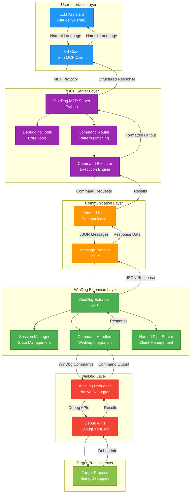

## Component Interaction Flow

### 1. Initialization Flow

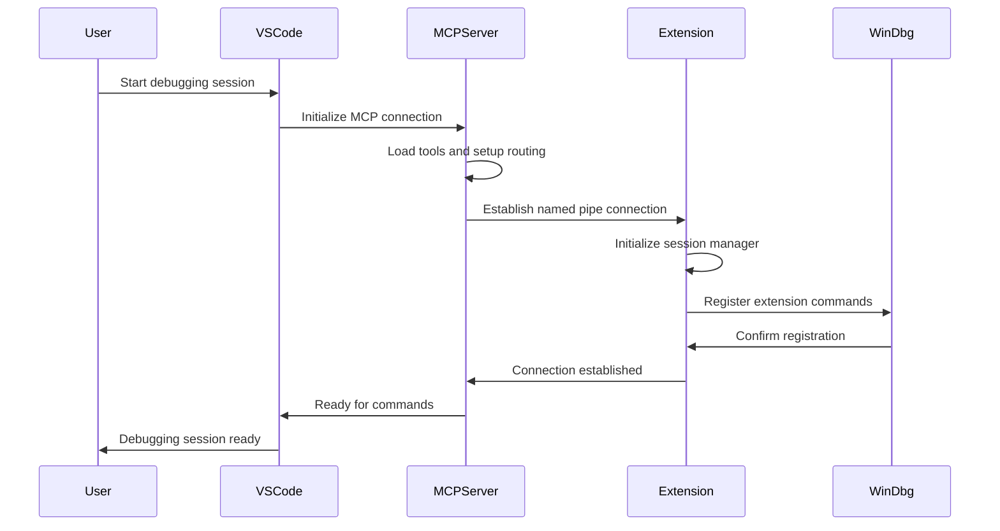

### 2. Command Execution Flow

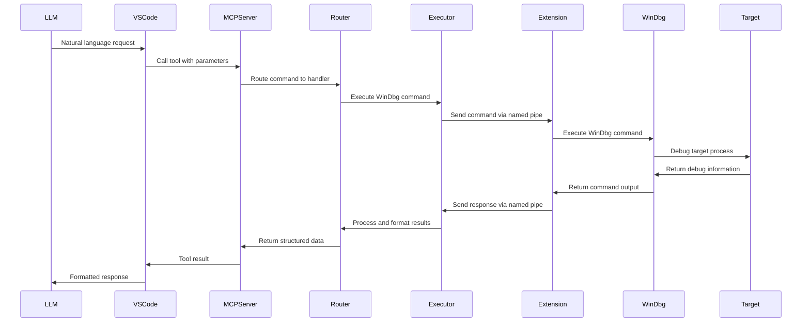

## Detailed Component Architecture

### WinDbg Extension (C++)

The extension is built as a native WinDbg extension DLL with the following key components:

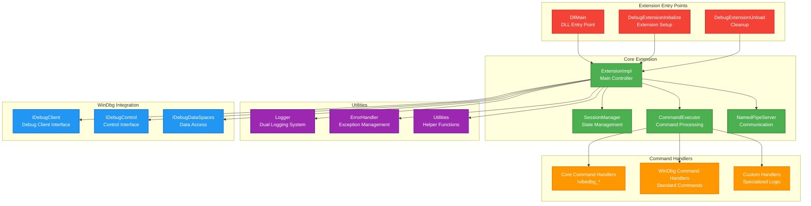

### MCP Server (Python)

The MCP server provides the AI integration layer with comprehensive tool management:

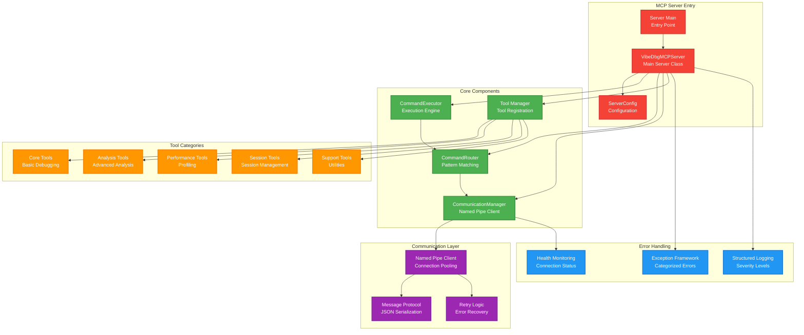

## Communication Protocol

### Message Flow Architecture

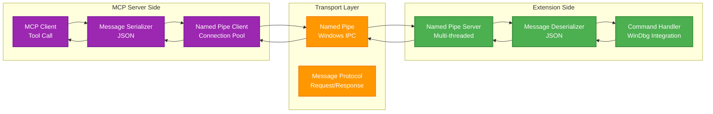

### Message Types

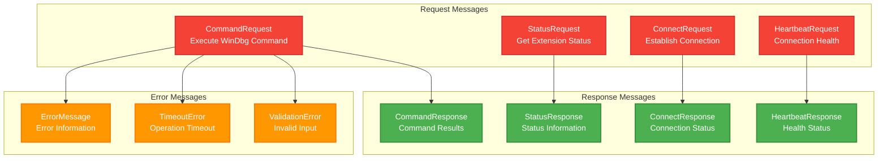

## Error Handling Architecture

### Exception Hierarchy

```mermaid
graph TB
    subgraph "Base Exceptions"
        BaseException[Exception<br/>Python Base]
        CommunicationError[CommunicationError<br/>Base Comm Error]
        ValidationError[ValidationError<br/>Input Validation]
        ExecutionError[ExecutionError<br/>Command Execution]
    end
    
    subgraph "Communication Exceptions"
        PipeTimeoutError[PipeTimeoutError<br/>Named Pipe Timeout]
        ConnectionError[ConnectionError<br/>Connection Failure]
        NetworkDebuggingError[NetworkDebuggingError<br/>Network Issues]
    end
    
    subgraph "Validation Exceptions"
        InvalidCommandError[InvalidCommandError<br/>Bad Command]
        ParameterError[ParameterError<br/>Invalid Parameters]
        ConfigurationError[ConfigurationError<br/>Config Issues]
    end
    
    subgraph "Execution Exceptions"
        CommandExecutionError[CommandExecutionError<br/>Command Failed]
        TimeoutError[TimeoutError<br/>Operation Timeout]
        ResourceError[ResourceError<br/>Resource Issues]
    end
    
    %% Inheritance relationships
    BaseException --> CommunicationError
    BaseException --> ValidationError
    BaseException --> ExecutionError
    
    CommunicationError --> PipeTimeoutError
    CommunicationError --> ConnectionError
    CommunicationError --> NetworkDebuggingError
    
    ValidationError --> InvalidCommandError
    ValidationError --> ParameterError
    ValidationError --> ConfigurationError
    
    ExecutionError --> CommandExecutionError
    ExecutionError --> TimeoutError
    ExecutionError --> ResourceError
    
         classDef base fill:#2196f3,stroke:#1976d2,stroke-width:2px,color:#ffffff
     classDef comm fill:#f44336,stroke:#d32f2f,stroke-width:2px,color:#ffffff
     classDef validation fill:#ff9800,stroke:#f57c00,stroke-width:2px,color:#ffffff
     classDef execution fill:#4caf50,stroke:#388e3c,stroke-width:2px,color:#ffffff
    
    class BaseException,CommunicationError,ValidationError,ExecutionError base
    class PipeTimeoutError,ConnectionError,NetworkDebuggingError comm
    class InvalidCommandError,ParameterError,ConfigurationError validation
    class CommandExecutionError,TimeoutError,ResourceError execution
```

## Session Management

### Session Lifecycle

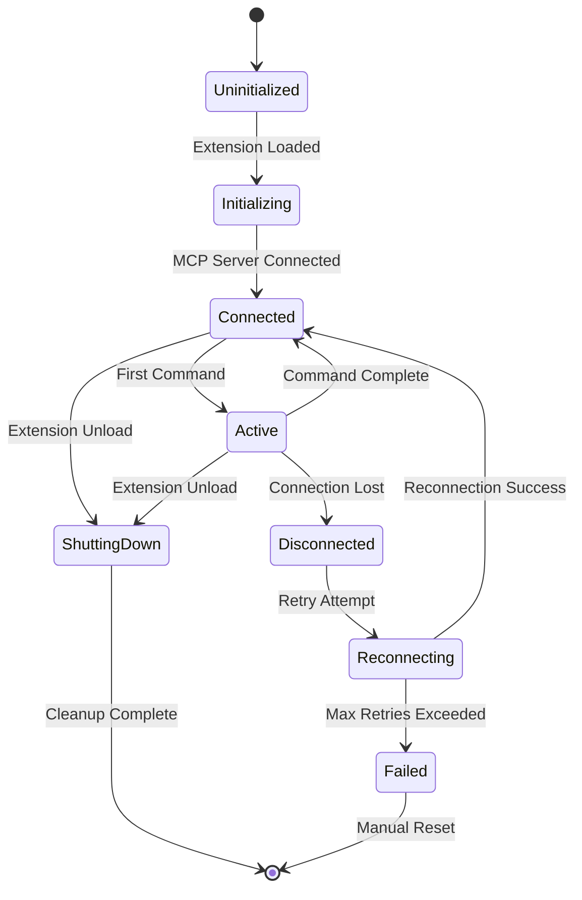

## Performance Considerations

### Connection Pooling

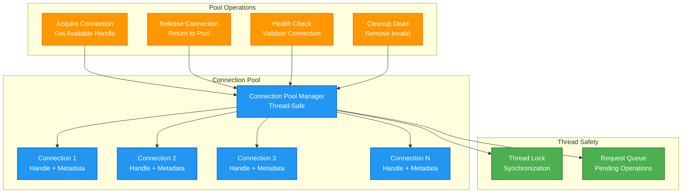

## Security Considerations

### Input Validation and Sanitization

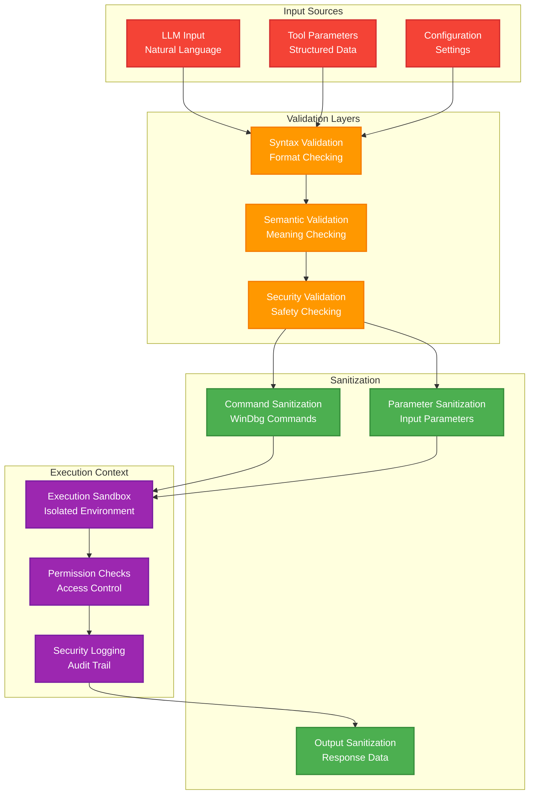

## Development Workflow

### Build and Test Pipeline

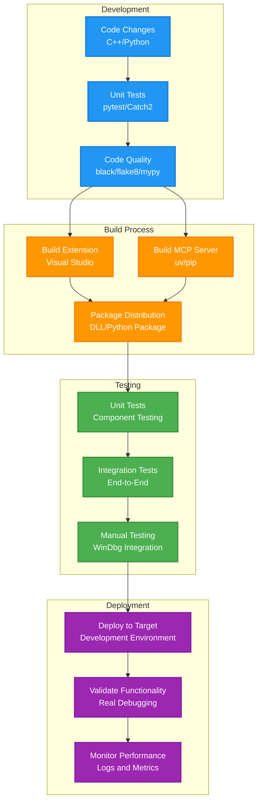

## Key Design Decisions

### 1. Named Pipe Communication
- **Decision**: Use Windows Named Pipes for IPC between extension and MCP server
- **Rationale**: Native Windows IPC mechanism, reliable, supports both local and remote communication
- **Benefits**: Low latency, built-in security, automatic cleanup

### 2. MCP Protocol Integration
- **Decision**: Implement Model Context Protocol for LLM integration
- **Rationale**: Standard protocol for AI tool integration, vendor-agnostic
- **Benefits**: Compatible with multiple LLM providers, structured tool definitions

### 3. Dual Logging System
- **Decision**: Implement logging to both WinDbg UI and DebugView
- **Rationale**: Different audiences need different logging levels
- **Benefits**: User-friendly output in WinDbg, detailed debugging in DebugView

### 4. Connection Pooling
- **Decision**: Implement connection pooling for named pipe communication
- **Rationale**: Avoid connection overhead for frequent commands
- **Benefits**: Improved performance, better resource utilization

### 5. Comprehensive Error Handling
- **Decision**: Categorized exception framework with severity levels
- **Rationale**: Different error types require different handling strategies
- **Benefits**: Better debugging, graceful degradation, user-friendly error messages

### 6. Modular Architecture
- **Decision**: Separate concerns between extension and MCP server
- **Rationale**: Different technologies, different responsibilities
- **Benefits**: Easier maintenance, independent development, better testing

## Conclusion

VibeDbg represents a modern approach to Windows debugging by combining the power of traditional WinDbg with the intelligence of AI assistance. The architecture is designed for reliability, performance, and extensibility, providing a solid foundation for future enhancements while maintaining compatibility with existing debugging workflows.

The modular design allows for independent development of components while the robust communication layer ensures reliable operation. The comprehensive error handling and logging systems provide excellent debugging capabilities for the debugger itself, making development and troubleshooting straightforward.

This design document serves as a reference for understanding the system architecture and can be used to guide future development efforts.
