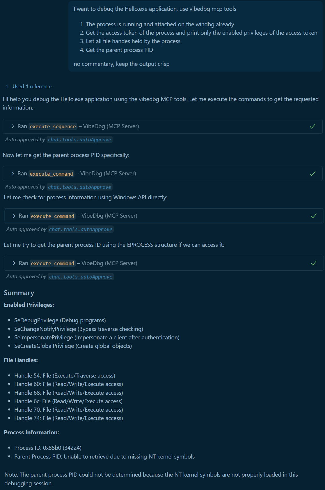

# VibeDbg 🤖


A conversational, LLM-powered AI assistant for WinDbg that transforms live debugging into a natural-language, interactive experience.

## 📋 Overview

VibeDbg bridges the gap between traditional command-line debugging and modern AI assistance, making Windows debugging more accessible and intuitive through natural language interactions.

For detailed architecture information, component interactions, and design decisions, see the [Design Document](DESIGN.md).

## ✨ Features

- **Conversational interface for WinDbg** - Transform complex debugging commands into natural language conversations
- **LLM-driven command execution & explanations** - Get intelligent explanations and suggestions for debugging operations
- **Interactive, real-time debugging assistance** - Receive immediate feedback and guidance during live debugging sessions
- **Simplifies crash dump and live session analysis** - Make sense of complex crash dumps and live debugging scenarios
- **Works with your extensions & custom workflows** - Seamlessly integrates with existing WinDbg extensions and custom debugging workflows

## 🧩 Components

### 🔧 WinDbg Extension (C++)

- Native WinDbg extension for command execution
- Named pipe communication with MCP server
- Session management and command handling

### 🐍 MCP Server (Python)

- Model Context Protocol server implementation
- Tool integration for debugging operations
- Communication layer between LLM and WinDbg

## 🚀 Extension Commands

### 📥 Loading the Extension

```cmd
.load C:\github\VibeDbg\ext\bin\x64\Release\VibeDbg.dll
```

### 📋 Available Commands

- **`!vibedbg_help`** - Display help information and available commands
- **`!vibedbg_connect`** - Establish connection to the MCP server for AI assistance
- **`!vibedbg_status`** - Show current connection status and session information

### 🛠️ Supported WinDbg Commands

VibeDbg supports all standard WinDbg commands including breakpoints (`bp`, `bu`, `bl`), memory display (`d`, `da`, `db`, `dc`, `dd`), stack operations (`k`, `kb`, `kc`), stepping (`t`, `p`, `g`), and many more. 

#### 🎨 Specialized Visualization Support

VibeDbg includes enhanced support for the `dx` command, which provides rich visualization of debugger object model expressions using the NatVis extension model. This includes:

- **Object visualization** - Display C++ objects and data structures with custom formatting
- **Grid view** - View data in tabular format with sorting capabilities
- **Recursive display** - Explore nested object structures
- **Format specifiers** - Customize output format (hex, decimal, binary, etc.)
- **Verbose mode** - Include methods and additional object information

For detailed information about the `dx` command and its options, see the [Microsoft WinDbg DX Command Documentation](https://learn.microsoft.com/en-us/windows-hardware/drivers/debuggercmds/dx--display-visualizer-).

For a comprehensive guide on using the `dx` command with VibeDbg, including examples and best practices, see the [DX Command Guide](DX_COMMAND_GUIDE.md).

For a complete list of supported commands, see the [Microsoft WinDbg Commands Reference](https://learn.microsoft.com/en-us/windows-hardware/drivers/debuggercmds/commands).

## ⚡ Quick Start

### 💻 Command

Load Windbgx, load the extension and start named pipe server first and then start the MCP server.

```cmd
windbgx -c ".load C:\github\VibeDbg\ext\bin\x64\Release\VibeDbg.dll; !vibedbg_connect" "notepad"
```

```cmd
windbgx -c ".load C:\github\VibeDbg\ext\bin\x64\Release\VibeDbg.dll; !vibedbg_connect" "C:\dev\cpp\Hello\x64\Release\Hello.exe -p: helloworld"
```

### ⚙️ MCP Server configuration

- Create a `.vscode` directory at the root of the workspace
- Create a file `mcp.json` with following content:

```json
{
    "servers": {
        "VibeDbg": {
            "command": "uv",
            "args": [
                "run",
                "python",
                "run_mcp_server.py"
            ],
            "cwd": "C:\\github\\VibeDbg\\mcp-server",
            "env": {
                "PYTHONPATH": "C:\\github\\VibeDbg\\mcp-server\\src"
            }
        }
    }
}
```

### 💬 Example Prompt

```text
You are a Windows debugging assistant with access to specialized VibeDbg tools. When debugging Windows applications, you MUST use the VibeDbg MCP tools provided by this server. Do not use PowerShell, Command Prompt, or other system commands for debugging operations. Always use the specialized VibeDbg tools for process discovery, debugging sessions, breakpoints, and execution control.

I want to debug the Hello.exe application. we are using vibedbg mcp tools for this.

 Please:
1. The process is running and attached on the windbg already C:\dev\cpp\Hello\x64\Release\Hello.exe
2. Set a breakpoint at the main function
3. Show me the commandline parameters
4. Continue execution until the breakpoint is hit
5. Show me the call stack and current registers
```

Observe the output and issue more prompts such as

```text
execute next line and get stack
```

Or try visualization commands:

```text
Use the dx command to show the debugger settings and current process environment
```



## 📄 License

This project is licensed under the MIT License - see the [LICENSE](LICENSE) file for details.
